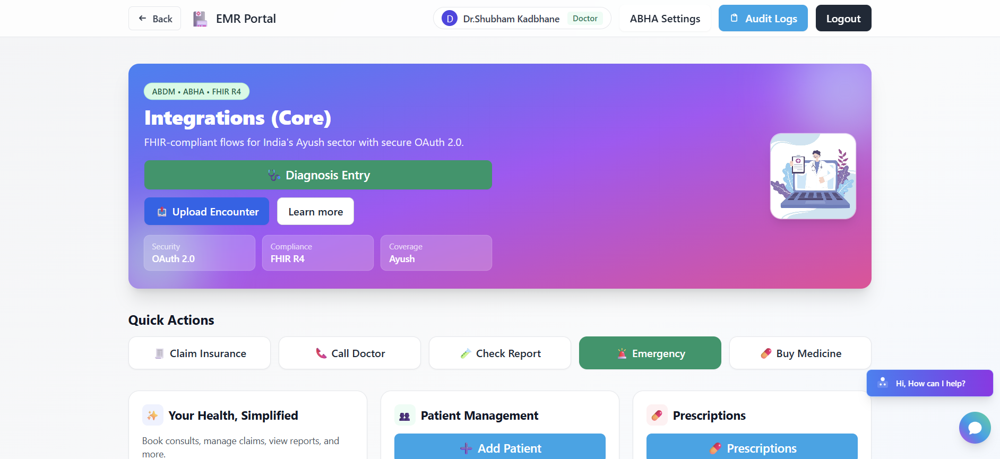
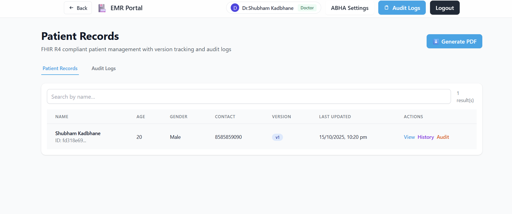
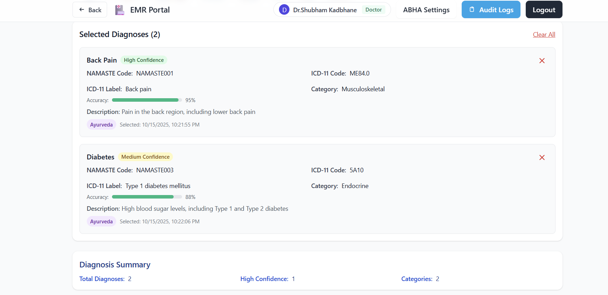

# 🔥 NAMASTE ↔ ICD-11 Dual-Coding FHIR Integration Microservice  
### 🧠 Smart India Hackathon (SIH 2025) Project  

A lightweight, FHIR-compliant terminology microservice that integrates **India’s NAMASTE (National AYUSH Morbidity & Standardized Terminologies Electronic)** codes with **WHO ICD-11 Traditional Medicine Module (TM2) and Biomedicine** codes — enabling **dual coding** of diagnoses in Electronic Medical Records (EMRs) aligned with **India’s 2016 EHR Standards**.

---

## 🚀 Key Features
- 🧩 **Dual Coding:** Automatic mapping between NAMASTE & ICD-11 (TM2 + Biomedicine)  
- 🔍 **Auto-Complete Search:** Real-time lookup for AYUSH and ICD-11 terms  
- 🌐 **FHIR R4 Compliant:** Supports CodeSystem, ConceptMap & ProblemList resources  
- 🔄 **Terminology Sync:** Ingest NAMASTE CSV and sync with WHO ICD-API updates  
- 🔐 **Secure Login:** ABHA-based OAuth 2.0 authentication with audit trails  
- 🧾 **FHIR Bundle Upload:** Enables dual-coded diagnosis entries within EMR systems  

---

## 🏗️ Architecture Overview


---

## 🧰 Tech Stack

| Component | Technology | Purpose |
|------------|-------------|----------|
| **Backend** | FastAPI | Lightweight, high-performance FHIR REST APIs |
| **Frontend** | React + TailwindCSS | Clean and responsive clinician interface |
| **Database (Structured)** | PostgreSQL | Stores FHIR resources & audit logs |
| **Database (Unstructured)** | MongoDB | Stores terminology data & mappings |
| **Auth Layer** | OAuth 2.0 with ABHA | Secure NDHM/ABDM-compliant access |
| **Containerization** | Docker | Easy deployment as a microservice |
| **NLP Utilities** | Libindic / Indic NLP | Transliteration & script normalization |
| **External APIs** | WHO ICD-11 API | Fetch TM2 and Biomedicine updates |

---

## 🧮 Dual-Coding Algorithm
1. **Exact Match (FHIR ConceptMap)** – Direct NAMASTE ↔ ICD-11 link.  
2. **String Similarity** – Levenshtein / Jaro-Winkler for near matches.  
3. **Semantic Mapping** – SNOMED-CT & WHO Ayurvedic ontology bridging.  
4. **Hybrid Output** – Dual code stored in the same ProblemList entry.

---

## 🔐 Login & Access Flow
1. User logs in via **ABHA ID** → OAuth 2.0 authorization.  
2. NDHM Gateway verifies credentials → issues access token.  
3. Role-based access (Doctor / Patient / Ministry).  
4. Every action is logged (ISO 22600 audit trail).
<p align="center">  </p>
<p align="center">  </p>

---

## 🧪 Testing & Validation
- FHIR JSON schema validation (HL7 R4).  
- Accuracy metrics: Precision, Recall, F1-score for mapping validation.  
- Unit tests using **pytest** and **FHIR validator**.
<p align="center">  </p>
<p align="center">  </p>
<p align="center">  </p>


---

## ⚙️ Setup & Installation

### 1. Clone Repository
```bash
git clone https://github.com/Shubham-K9/NAMASTE-ICD11-Integration.git
cd NAMASTE-ICD11-Integration
---

```
###2.To Run the Project:
-Make sure npm dependencies are installed in your machine
-npm run dev
-It will be live on http://localhost:5173 


